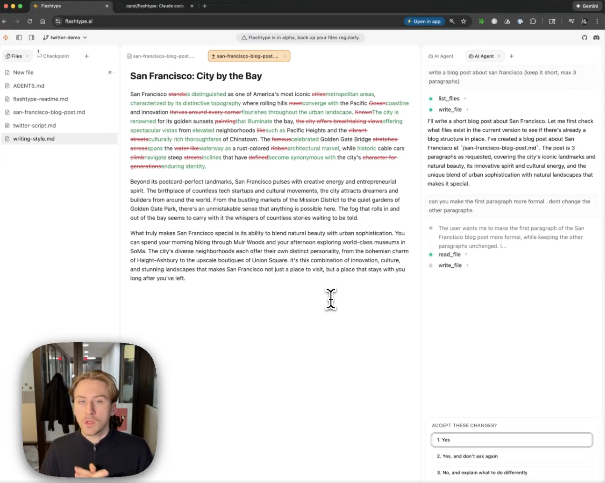

# ⚡ Flashtype

**A claude code style markdown editor demo for the [Lix](https://lix.dev) version control system.**

Flashtype is a WYSIWYG markdown editor built on the Lix SDK. It serves as both a showcase for Lix's capabilities and a real-world application that drives the SDK's development—proving that embeddable version control enables powerful features like AI-assisted editing, change proposals, and full document history, all running entirely in the browser.

## 🎯 What This Demonstrates

Flashtype demonstrates key Lix capabilities:

| Lix Feature             | How Flashtype Uses It                                                         |
| ----------------------- | ----------------------------------------------------------------------------- |
| **History**             | Every edit is tracked. See exactly what changed, when, and by whom.           |
| **Versions (Branches)** | AI generates content in isolated versions, letting you review before merging. |
| **Diffs**               | Claude Code-style accept/reject UI shows granular changes inline.             |
| **Change Proposals**    | AI proposes edits, humans stay in control of what ships.                      |
| **Single SQLite File**  | Your documents persist in browser storage as a portable `.lix` file.          |

## 🚀 Try It

Visit [flashtype.ai](https://flashtype.ai) to try it in your browser—no installation required.

## 🔗 Learn More About Lix

Lix is an embeddable version control system that enables Git-like features for any file format:

- **[Lix Documentation](https://lix.dev/docs)** — Full SDK reference and guides
- **[Getting Started](https://lix.dev/docs/getting-started)** — Build your first app with Lix
- **[GitHub](https://github.com/opral/lix-sdk)** — Report issues and contribute
- **[Discord](https://discord.gg/gdMPPWy57R)** — Get help and join the community

## 📋 Features

- **WYSIWYG Markdown** — No preview tabs. Type `# Heading` and see it rendered instantly.
- **Claude Code-style AI** — Generate content, review diffs, accept/reject changes.
- **Browser-native** — Zero install, works offline, syncs optionally.
- **Markdown as Source of Truth** — Lossless copy/paste between tools like GitHub, ChatGPT, and Discord.
